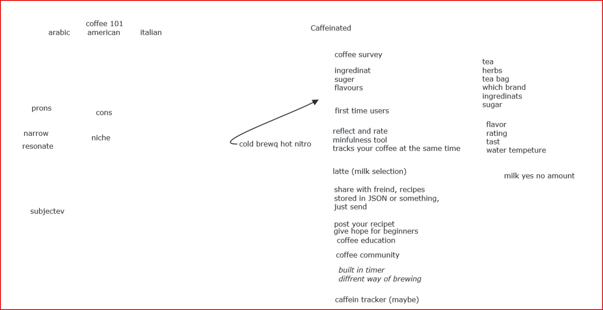
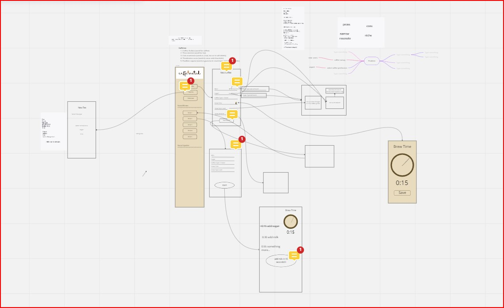

# WEEK 4  BrainStorming #
---
- Date: 10/18
---
- Place: Over Zoom
---
Team member info:  
- [X] Matthieu Dante Pardin - Team Lead (mpardin@ucsd.edu) 
- [X] Sarkis Bouzikian - Team Lead (sbouzikian@ucsd.edu) 
- [ ] Alexander Kourjanski - Planner (akourjan@ucsd.edu) 
- [X] Daniel Ziper - Designer (dziper@ucsd.edu) 
- [X] Derek Zhu - Developer (daz005@ucsd.edu) 
- [X] Eric Tran - Developer (e7tran@ucsd.edu) 
- [X] Ella Tung - Developer (etung@ucsd.edu)
---
## requierments ##
- Personal information managment
- CRUD 
- Local First
- Collaborative
---
# Meeting Breakdown #

- Talk about what we need to do this week and the coming week 
- Sarkis/Derek idea: Caffeine tracking recipies app, that includes coffee 
- Dante to make an app keep track of resume easy & editable

Then we talk about more detail how to go and build the app Caffeianted that works with our team moto 
The following pdf is notes taken during the brainstorm on the app idea
 

