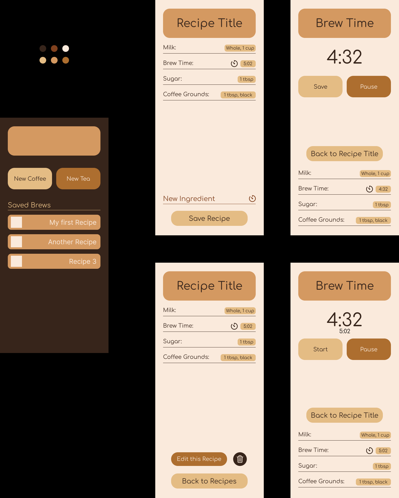
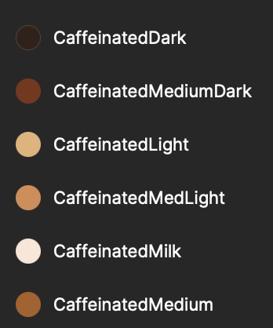
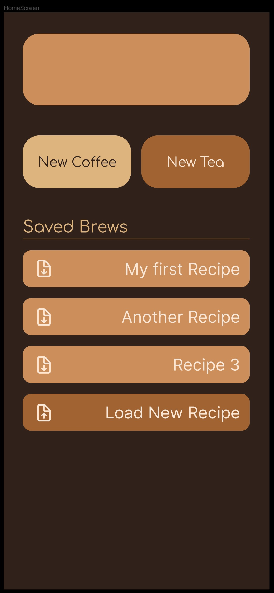
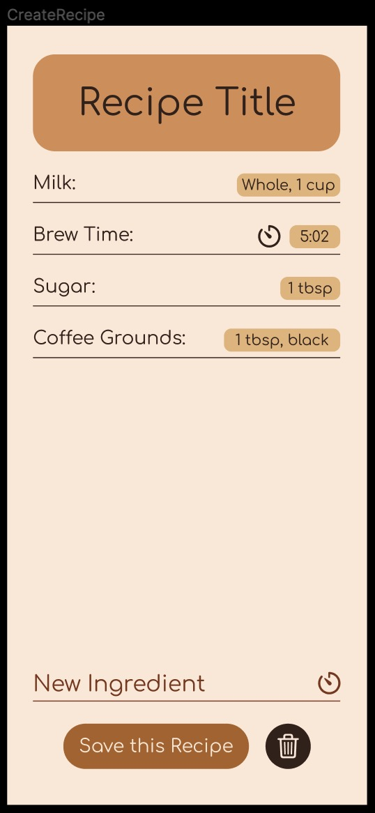
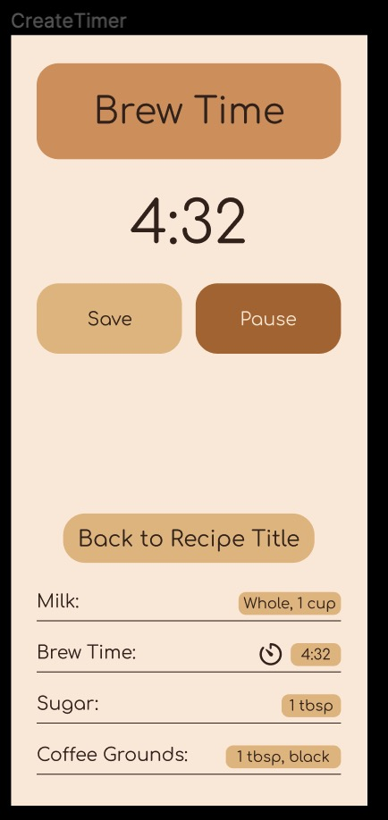
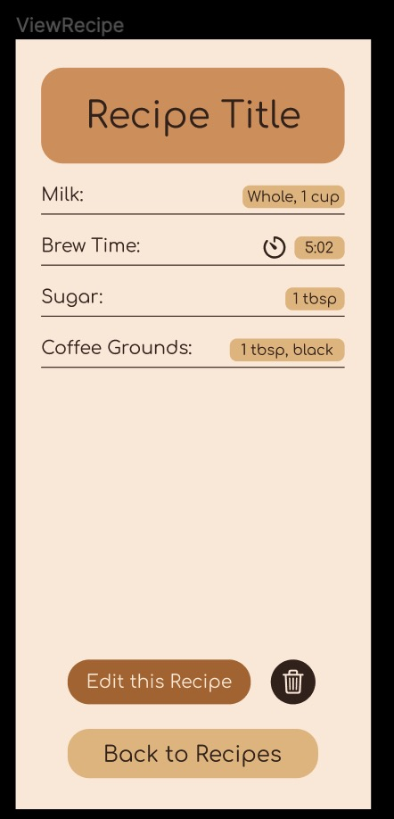
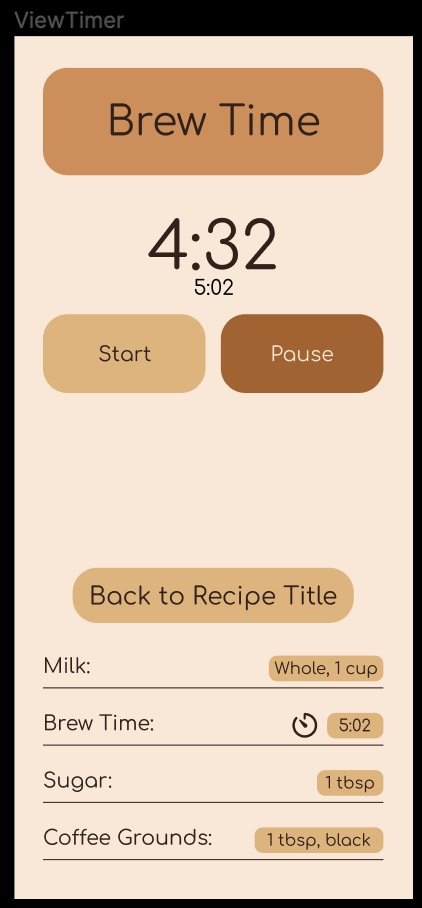

## Wireframe for Mobile View
[Figma Prototype](https://www.figma.com/file/ji6HJPj8p5tGt9Mrhyk2W3/Wireframe?node-id=0%3A1&t=33D635xKZsiyElx5-1)
- Click Play Button on Top Right to see interactive "Prototype" App

### Design Elements

Colors used:
- CaffeinatedDark: `0x37251B`
  - HomeScreen background
  - Most text
- CaffeinatedMediumDark: `0x80411E`
- CaffeinatedMedium: `0xAD6E2F`
- CaffeinatedMedLight: `0xD49961`
  - Title Backgrounds
- CaffeinatedLight: `0xE4BC84`
  - Button Backgrounds
- CaffeinatedMilk: `0xFAEADC`
  - Background for Recipe and Timer Views 

Font: Comfortaa Regular
- Title: 40
- Timer: 64, 20
- Ingredients: 20, 16
- Buttons: 20, 24

Buttons
- Big Buttons: Corner radius 24px
- Saved Brews: Corner radius 12px
- Ingredients: Corner raidus 8px

### Views
#### HomeScreen
- Logo/graphic on top
- Big Buttons for New Tea and New Coffee
  - Click -> CreateRecipe View
- List of Saved Brews
  - Click -> ViewRecipe View
  - Click Download Icon -> Download Shareable Recipe JSON
  - Click Load Recipe -> Opens File Browser to Upload Shareable Recipe JSON

#### CreateRecipe
- Editable Recipe Title
- List of Ingredients
  - Each ingredient has a name, amount, and timer bool
  - Name and amount is editable text
- New Ingredient
  - Clicking on Button creates new Ingredient in list
  - Clicking on Timer Icon -> CreateTimer View
- Save Recipe
  - Click -> HomeScreen, Saves recipe to local storage
- Trash Icon
  - Click -> Deletes Recipe, returns to Home Screen

#### CreateTimer
- Creates a New Ingredient with a Timer
- Editable Ingredient Name for the title
- Count up timer
- Start/Save Button, Pause/Reset Button
- Ingredients List
  - Non-editable list of Ingredients
- Back to Recipe Button
  - Click -> CreateRecipe
  - Automatically saves current timer value

#### ViewRecipe
- Recipe Title
- List of Ingredients
  - Each ingredient has a name, amount, and timer bool
    - Clicking Timer Icon -> ViewTimer View
  - Non-Editable in this view
- Edit Recipe Button
  - Click -> CreateRecipe View
- Trash Button
  - Click -> Popup confirmation, Deletes Recipe, goes to HomeScreen
- Save Recipe
  - Click -> HomeScreen, Saves recipe to local storage

#### ViewTimer
- Ingredient Name for the title
- Count Down Timer with total time displayed underneath
- Start, Pause/Reset Button
- Ingredients List
  - Non-editable list of Ingredients
- Back to Recipe Button
  - Click -> ViewRecipe

